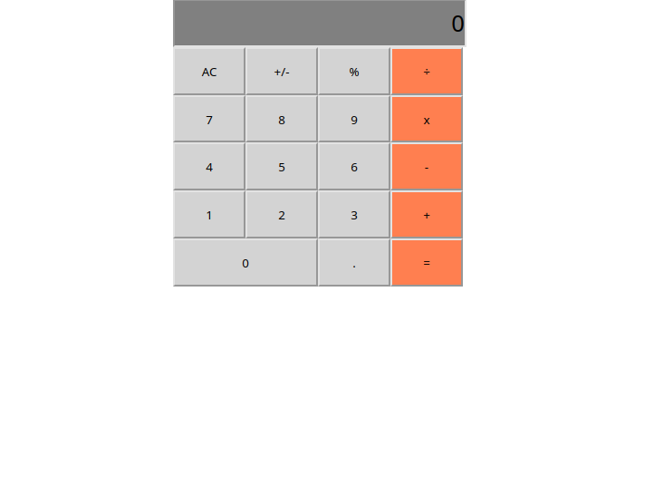

# Project Name

> "Math magicians" is a website for all fans of mathematics. It is a Single Page App (SPA) that allows users to:
  - Make simple calculations.
  - Read a random math-related quote.

  By building this application, I will get my first experiance of React.

## Built With

- Html, CSS, Javascript
- React
- Webpack, Jest, Gitflow

## Live Demo

[Live Demo Link](https://compassionate-beaver-6b1347.netlify.app/)

## Getting Started

To get a local copy up and running in your machine:

    1.Clone this repo or download the zip folder:

      git clone https://github.com/Lockless404/dotaCapstone.git

    2.Navigate to the location of the folder in your machine:

      you@your-Pc-name:~$ cd <folder>

## Authors

👤 **Hamza Tarar**

- GitHub: [@Lockless404](https://github.com/Lockless404)
- Twitter: [@hamza_tarar10](https://twitter.com/hamza_tarar10)
- LinkedIn: [Hamza Tarar](https://www.linkedin.com/in/hamza-tarar-639685216/)

## 🤝 Contributing

Contributions, issues, and feature requests are welcome!

Feel free to check the [issues page](../../issues/).

## Show your support

Give a ⭐️ if you like this project!

## Acknowledgments

- Hat tip to anyone whose code was used
- Inspiration
- etc

## 📝 License

This project is [MIT](./MIT.md) licensed.
